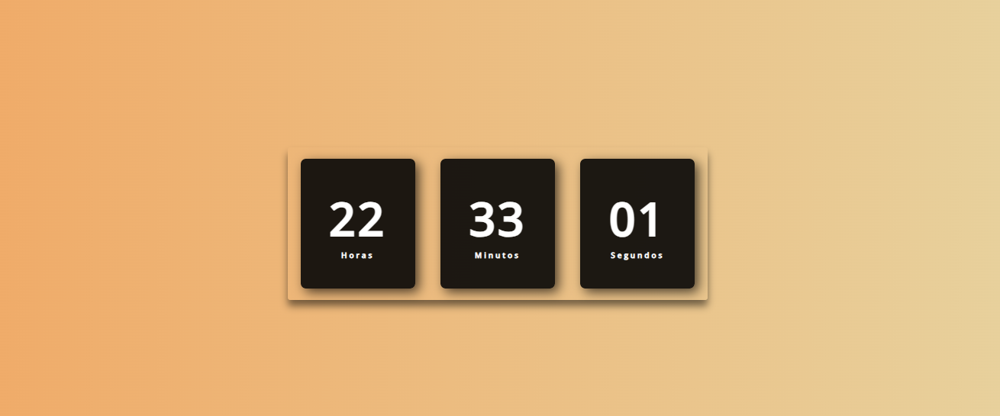

# ⏰ Relógio Digital

Relógio digital com fundo animado em degradê, que mostra horas, minutos e segundos em tempo real.

---

## 🛠️ Tecnologias

- HTML5
- CSS3 (com animação de fundo)
- JavaScript

---

## 🚀 Funcionalidades

- Fundo degradê animado que muda de cor
- Relógio em tempo real com horas, minutos e segundos
- Layout responsivo e moderno

---

## 📸 Imagem do Projeto

---

## 🌐 Visualize o projeto:

[Ver Projeto Online](https://carolinersant.github.io/relogio-digital/)

---
## 🛠 Como usar

1. Clone este repositório ou baixe os arquivos.
2. Abra o arquivo `index.html` no seu navegador.
